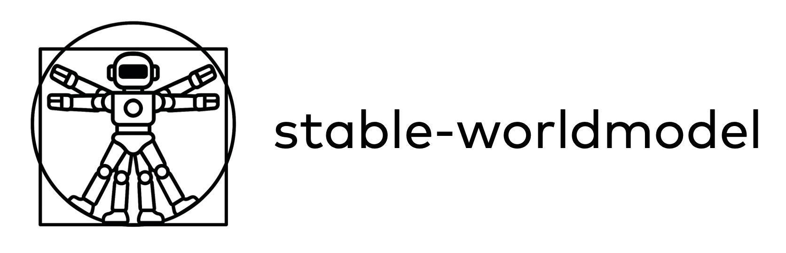

# stable-worldmodel

<p align="center">
  
</p>

[](https://pytorch.org/get-started/locally/)
[](https://github.com/astral-sh/ruff)
[](https://opensource.org/licenses/MIT)

A stable library for world model research and evaluation, providing unified interfaces for data collection, model training, and policy evaluation.

## Features

- � **Control Factors of Variation**: Manage and track environmental factors with extended Gymnasium spaces
- 🔬 **Complete Solver Support**: Multiple planning algorithms (CEM, Gradient Descent, MPPI, Random)
- ✅ **High Test Coverage**: Comprehensive test suite ensuring reliability and correctness

## Installation

### Requirements
- Python 3.10+

### Quick Start

1. **Install uv** (fast Python package manager):
```bash
pip install uv
```

2. **Clone and install the package**:
```bash
git clone https://github.com/rbalestr-lab/xenoworlds.git
cd xenoworlds
uv pip install -e .
```

### Development Installation

For development with testing and documentation tools:
```bash
uv pip install -e . --group dev --group doc
```

## Quick Example

```python
import stable_worldmodel as swm
import torch

# Create environment
world = swm.World(
    "swm/SimplePointMaze-v0",
    num_envs=7,
    image_shape=(224, 224),
    render_mode="rgb_array",
)

# Collect training data
world.set_policy(swm.policy.RandomPolicy())
world.record_dataset("simple-pointmaze", episodes=10, seed=2347)

# Train world model
swm.pretraining(
    "scripts/train/dummy.py",
    "++dump_object=True dataset_name=simple-pointmaze output_model_name=dummy_test"
)

# Load and evaluate
action_dim = world.envs.single_action_space.shape[0]
world_model = swm.wm.DummyWorldModel((224, 224, 3), action_dim)
solver = swm.solver.RandomSolver(
    horizon=5,
    action_dim=action_dim,
    cost_fn=torch.nn.functional.mse_loss
)
policy = swm.policy.WorldModelPolicy(
    world_model, solver,
    horizon=10, action_block=5, receding_horizon=5
)
world.set_policy(policy)

results = world.evaluate(episodes=2, seed=2347)
print(results)
```

## Project Structure

```
stable_worldmodel/
├── envs/          # Custom Gymnasium environments
├── solver/        # Planning algorithms (CEM, GD, MPPI, Random)
├── wm/            # World model implementations
├── tests/         # Test suite
├── policy.py      # Policy implementations
├── spaces.py      # Extended Gymnasium spaces with state tracking
├── world.py       # Main World interface
└── utils.py       # Utility functions
```

## Testing

Run tests with coverage:
```bash
pytest --cov=stable_worldmodel --cov-report=term-missing
```

## Contributors

- [Randall Balestriero](https://github.com/RandallBalestriero)
- [Dan Haramati](https://github.com/DanHrmti)
- [Lucas Maes](https://github.com/lucas-maes)

## License

MIT License - see [LICENSE](LICENSE) file for details.


