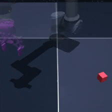
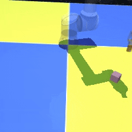
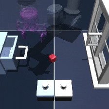

<!--  -->

## Description

A suite of 3D robotic manipulation environments built on [OGBench](https://github.com/seohongpark/ogbench) and [MuJoCo](https://mujoco.org/). The environments feature a UR5e robotic arm with a Robotiq gripper performing various manipulation tasks including pick-and-place, stacking, and complex scene interactions.

Two environment families are available:

- **Cube**: Pure cube manipulation tasks with 1-8 colored cubes
- **Scene**: Complex scene with cubes, buttons, a drawer, and a window

```python
import stable_worldmodel as swm

# Cube environment - set env_type to: single, double, triple, quadruple, or octuple
world = swm.World('swm/OGBCube-v0', num_envs=4, env_type='single')

# Scene environment (cube + drawer + window + buttons)
world = swm.World('swm/OGBScene-v0', num_envs=4)
```

---

## Cube Environment




Manipulation tasks involving 1-8 colored cubes that must be moved to target positions. Tasks include pick-and-place, swapping positions, and multi-cube stacking.

**Success criteria**: All cubes must be within 4cm of their target positions.

### Environment Specs

| Property | Value |
|----------|-------|
| Action Space | `Box(-1, 1, shape=(7,))` — 6 joint velocities + gripper |
| Observation Space | Pixels `(224, 224, 3)` or state vector |
| Reward | Number of cubes at target minus total cubes |
| Episode Length | 200 steps |
| Render Size | 224×224 (configurable) |
| Physics | MuJoCo |

### Environment Types

| `env_type` | Cubes |
|------------|-------|
| `single` | 1 |
| `double` | 2 |
| `triple` | 3 |
| `quadruple` | 4 |
| `octuple` | 8 |

### Info Dictionary

| Key | Description |
|-----|-------------|
| `goal` | Goal observation (state or pixels) |
| `success` | Whether all cubes are at targets |
| `proprio/*` | Robot proprioception (joint pos/vel, gripper state) |
| `privileged/block_{i}_pos` | Position of cube i |
| `privileged/block_{i}_quat` | Orientation of cube i |

### Variation Space





| Factor | Type | Description |
|--------|------|-------------|
| `cube.color` | Box(0, 1, shape=(N, 3)) | RGB colors for each cube |
| `cube.size` | Box(0.01, 0.03, shape=(N,)) | Cube half-extents |
| `agent.color` | Box(0, 1, shape=(3,)) | Robot arm color |
| `floor.color` | Box(0, 1, shape=(2, 3)) | Checkerboard floor colors |
| `camera.angle_delta` | Box(-10, 10, shape=(1, 2)) | Camera yaw/pitch offsets |
| `light.intensity` | Box(0, 1, shape=(1,)) | Scene lighting intensity |

---

## Scene Environment




A complex manipulation scene with a single cube, two lock buttons, a drawer, and a window. Tasks require interacting with multiple objects in sequence (e.g., press button to unlock drawer, then open drawer).

**Success criteria**: All objects must be in their target configurations (cube position, button states, drawer position, window position).

### Environment Specs

| Property | Value |
|----------|-------|
| Action Space | `Box(-1, 1, shape=(7,))` — 6 joint velocities + gripper |
| Observation Space | Pixels `(224, 224, 3)` or state vector |
| Episode Length | 200 steps |
| Environment ID | `swm/OGBScene-v0` |

### Scene Objects

| Object | Description |
|--------|-------------|
| Cube | Single cube to manipulate |
| Buttons (2) | Lock/unlock buttons for drawer and window |
| Drawer | Slidable drawer (locked by button 0) |
| Window | Slidable window (locked by button 1) |

### Tasks

1. **Open**: Open both drawer and window
2. **Unlock and Lock**: Toggle locks and close drawer/window
3. **Rearrange Medium**: Move cube and toggle some objects
4. **Put in Drawer**: Open drawer and place cube inside
5. **Rearrange Hard**: Complex multi-step rearrangement

### Variation Space


| Factor | Type | Description |
|--------|------|-------------|
| `cube.color` | Box(0, 1, shape=(1, 3)) | Cube RGB color |
| `cube.size` | Box(0.01, 0.03, shape=(1,)) | Cube half-extents |
| `lock_color` | Box(0, 1, shape=(2, 3)) | Colors for locked buttons/handles |
| `agent.color` | Box(0, 1, shape=(3,)) | Robot arm color |
| `floor.color` | Box(0, 1, shape=(2, 3)) | Checkerboard floor colors |
| `camera.angle_delta` | Box(-5, 5, shape=(1, 2)) | Camera yaw/pitch offsets |
| `light.intensity` | Box(0, 1, shape=(1,)) | Scene lighting intensity |

---

## Multiview Mode

Both environments support rendering from multiple camera angles simultaneously:

```python
# Enable multiview rendering
world = swm.World('swm/OGBCube-v0', num_envs=4, env_type='double', multiview=True)

# Returns dict with 'front_pixels' and 'side_pixels' keys
obs = world.reset()
```

## Expert Policy

Both environments include a built-in expert policy for data collection:

```python
from stable_worldmodel.envs.ogbench_manip import ExpertPolicy

policy = ExpertPolicy()
world.set_policy(policy)
```

## Datasets

| Name | Episodes | Environment |
|------|----------|-------------|
| `ogbench_cube_single` | 1000 | Cube-Single |
| `ogbench_cube_double` | 1000 | Cube-Double |
| `ogbench_scene` | 1000 | Scene |
