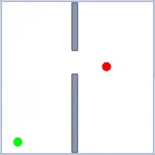
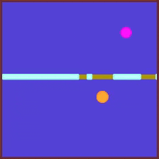

## Description

A 2D navigation task where a circular agent must reach a goal position in another room by navigating through doorways. The environment uses [Pymunk](http://www.pymunk.org/) physics simulation with a wall dividing the space into two rooms connected by one or more doors.

The agent starts in one room and must navigate to the goal in the other room while managing its limited energy. The task requires planning a path through the door openings rather than simple point-to-point navigation.

**Success criteria**: The episode is successful when the agent overlaps with the goal by at least 50% (either the agent covers 50% of the goal, or the goal covers 50% of the agent).

```python
import stable_worldmodel as swm
world = swm.World('swm/TwoRoom-v1', num_envs=4, image_shape=(128, 128))
```

## Environment Specs

| Property | Value |
|----------|-------|
| Action Space | `Box(-1, 1, shape=(2,))` — 2D velocity control |
| Observation Space | `Dict(proprio=(4,), state=(6,))` |
| Reward | +1 on success, -0.01 per step |
| Episode Length | Up to `max_energy` steps (default: 100) |
| Render Size | 224×224 (configurable) |
| Physics | Pymunk, 10 Hz control |

### Observation Details

| Key | Shape | Description |
|-----|-------|-------------|
| `proprio` | `(4,)` | Agent position (x, y), remaining energy, speed |
| `state` | `(6,)` | Agent pos (2), goal pos (2), energy, speed |

### Info Dictionary

The `info` dict returned by `step()` and `reset()` contains:

| Key | Description |
|-----|-------------|
| `goal` | Goal image (H, W, 3) |
| `pos_agent` | Current agent position |
| `pos_goal` | Goal position |
| `energy` | Remaining energy |
| `max_energy` | Maximum energy for this episode |
| `fraction_of_goal` | Overlap fraction (goal perspective) |
| `fraction_of_agent` | Overlap fraction (agent perspective) |
| `n_contacts` | Number of wall contacts this step |

## Variation Space




The environment supports extensive customization through the variation space:

| Factor | Type | Description |
|--------|------|-------------|
| `agent.color` | RGBBox | Agent color (default: red) |
| `agent.radius` | Box(15, 30) | Agent radius in pixels |
| `agent.position` | Box([9, 9], [494, 494]) | Starting position |
| `agent.max_energy` | Discrete(50, 200) | Maximum steps allowed |
| `agent.speed` | Box(10, 20) | Movement speed multiplier |
| `goal.color` | RGBBox | Goal color (default: green) |
| `goal.radius` | Box(15, 30) | Goal radius in pixels |
| `goal.position` | Box([9, 9], [494, 494]) | Goal position (constrained to other room) |
| `wall.color` | RGBBox | Wall color (default: gray) |
| `wall.thickness` | Discrete(9, 34) | Wall thickness in pixels |
| `wall.axis` | Discrete(2) | 0: horizontal, 1: vertical |
| `wall.border_color` | RGBBox | Border color |
| `door.color` | RGBBox | Door color (default: white/background) |
| `door.number` | Discrete(1, 3) | Number of doors |
| `door.size` | MultiDiscrete | Size of each door |
| `door.position` | MultiDiscrete | Position of each door along wall |
| `background.color` | RGBBox | Background color (default: white) |

### Default Variations

By default, these factors are randomized at each reset:

- `agent.position`
- `goal.position`
- `door.number`
- `door.size`
- `door.position`

To randomize additional factors:

```python
# Randomize colors for domain randomization
world.reset(options={'variation': ['agent.color', 'goal.color', 'background.color']})

# Randomize everything
world.reset(options={'variation': ['all']})
```

## Datasets

| Name | Episodes | Policy | Download |
|------|----------|--------|----------|
| `tworoom_expert` | 1000 | Weak Expert | — |

## Expert Policy

This environment includes a built-in weak expert policy for data collection:

```python
from stable_worldmodel.envs.two_room import ExpertPolicy

policy = ExpertPolicy()
world.set_policy(policy)
```
